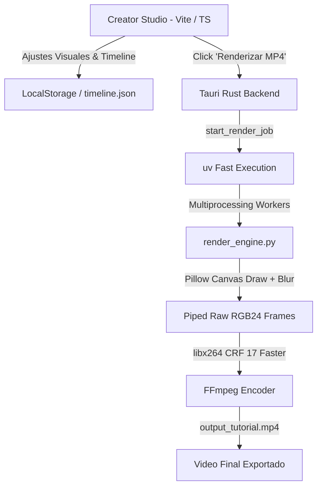

# 🎬 Creator Studio — Documento de Contexto y Arquitectura de Renderizado

Este documento detalla exhaustivamente la arquitectura técnica, el diagnóstico de discrepancias, las soluciones implementadas y las optimizaciones de rendimiento desarrolladas para lograr una fidelidad visual **100% Pixel-Perfect (1:1)** entre el **Creator Studio** (interfaz de edición interactiva basada en Vite + TypeScript + Tauri + Rust) y el **Motor de Renderizado Nativo** (`render_engine.py` + `uv` + Pillow + FFmpeg).

---

## 📑 Tabla de Contenidos
1. [Visión General del Sistema](#1-visión-general-del-sistema)
2. [Arquitectura del Pipeline de Renderizado](#2-arquitectura-del-pipeline-de-renderizado)
3. [Diagnóstico de Discrepancias Visuales (Causas Raíz)](#3-diagnóstico-de-discrepancias-visuales-causas-raíz)
4. [Soluciones Implementadas y Optimización Matemática](#4-soluciones-implementadas-y-optimización-matemática)
5. [Sincronización y Persistencia de Datos](#5-sincronización-y-persistencia-de-datos)
6. [Resumen de Versiones y Evolución del Engine](#6-resumen-de-versiones-y-evolución-del-engine)

---

## 1. Visión General del Sistema

El objetivo central del sistema es garantizar el principio **WYSIWYG** (*What You See Is What You Get*): cualquier ajuste realizado en el editor interactivo (coordenadas de cursor, tipografías, zoom, animaciones de clic, subtítulos con resaltado de palabras y encabezados personalizados) debe renderizarse de forma exactamente idéntica en el video exportado a Full HD (1920x1080 @ 30 FPS).

---

## 2. Arquitectura del Pipeline de Renderizado

### Componentes Clave:
1. **Frontend (Vite + TS + CSS Glassmorphic):**
   - Lienzo central con relación de aspecto $16:9$ ($1920 \times 1080$).
   - Mockup Window Browser flotante de $1540\text{px}$ de ancho con radio de aspecto $2.1893$ y altura de cabecera de $44\text{px}$.
   - Inspector lateral de propiedades con reactividad en tiempo real.
2. **Capa Nativa (Rust / Tauri IPC):**
   - Comandos `save_project` y `start_render_job`.
   - Streaming de eventos en tiempo real (`render-progress`) para informar el porcentaje de exportación en la UI.
3. **Motor de Renderizado Paralelo (`render_engine.py`):**
   - Ejecución acelerada con `uv run --with pillow python render_engine.py`.
   - Pool de procesos multiproceso (`ProcessPoolExecutor`) que renderiza lotes de fotogramas en paralelo utilizando todos los núcleos de CPU disponibles.
   - Envío de *raw video bytes* (RGB24) directamente a la tubería `stdin` de FFmpeg sin generar archivos temporales en disco.

---

## 3. Diagnóstico de Discrepancias Visuales (Causas Raíz)

Durante el proceso de auditoría y análisis comparativo entre las capturas de pantalla del Studio (`vista studio.png`) y el render previo (`sombras render.png`), se identificaron las siguientes falencias:

### A. Desfase del Cursor en Pasos con Zoom
* **Causa:** El script heredado calculaba la posición multiplicando las coordenadas normalizadas por el tamaño de la imagen interna escalada (`scaled_w`, `scaled_h`) sumando el desplazamiento (`offset_x`).
* **Realidad del DOM:** En el navegador, el elemento `#mockup-cursor` es hijo de `#mockup-viewport` y su posición se rige por porcentajes absolutos respecto al contenedor fijo de $1540 \times 703.4\text{px}$ (`left: (x * 100)%`), independiente de la textura con zoom interna.

### B. Sombras Duras y Planas vs. Desenfoques Gaussianos
* **Causa:** Pillow dibujaba sombras con rectángulos simples con canal alfa sin difuminar.
* **Realidad del DOM:** El Studio usa CSS multinivel:
  - Mockup: `box-shadow: 0 30px 80px rgba(0,0,0,0.85), 0 0 0 1px rgba(255,255,255,0.12)`.
  - Subtítulo: `box-shadow: 0 20px 40px rgba(0,0,0,0.7)`.
  - Intro (Paso 1): `text-shadow: 0 10px 40px rgba(0,0,0,0.8)`.

### C. Ausencia de Transiciones Suaves entre Pasos
* **Causa:** El render anterior saltaba instantáneamente entre las capturas de cada paso (corte duro), perdiendo la suavidad del crossfade visual.

### D. Desincronización del Encabezado Superior (`headerStyle`)
* **Causa:** Si el usuario desmarcaba la sombra (`hasShadow: false`) o cambiaba el texto o padding en el Studio, Python no recalculaba las dimensiones exactas del texto con respecto a la caja contenedora y dibujaba sombras rígidas.

---

## 4. Soluciones Implementadas y Optimización Matemática

### 1. Sistema Unificado de Coordenadas
Se calibraron las fórmulas de posicionamiento del mockup y del cursor:
$$\text{Lienzo} = 1920 \times 1080$$
$$\text{Mockup Width} = 1540\text{px}, \quad \text{Mockup Viewport Height} = \frac{1540}{2.1893} \approx 703.42\text{px}$$
$$\text{Mockup Header Height} = 44\text{px}, \quad \text{Total Mockup Height} = 747.42\text{px}$$
$$\text{Posición Canvas X} = \frac{1920 - 1540}{2} = 190.0\text{px}$$
$$\text{Posición Canvas Y} = 512.0 - \frac{747.42}{2} \approx 138.29\text{px}$$
$$\text{Cursor Viewport X} = \text{int}(\text{clickCoords.x} \times 1540) - 2$$
$$\text{Cursor Viewport Y} = \text{int}(\text{clickCoords.y} \times 703.42) - 2$$

### 2. Desenfoque Gaussiano Real (`ImageFilter.GaussianBlur`)
- **Pre-renderizado de Sombra de Mockup:** Se genera un mapa RGBA difuso con `GaussianBlur(radius=28)` una sola vez en el inicializador del worker (`init_worker`), reduciendo el consumo de CPU por fotograma.
- **Sombra de Subtítulos:** Se aplica `GaussianBlur(radius=18)` desplazada $20\text{px}$ en el eje vertical con opacidad del 70%.
- **Glow de Palabras Activas:** Efecto de resplandor `GaussianBlur(radius=4)` alrededor del texto blanco activo.
- **Intro (Paso 1):** Sombra suave con `GaussianBlur(radius=14)` desplazada $10\text{px}$ verticalmente.

### 3. Transiciones Fluidas (Crossfade & Stage-Enter)
- **Crossfade entre Pasos (0.4s):** Durante los primeros $400\text{ms}$ de un nuevo paso, la captura anterior se superpone con curva `ease_in_out_cubic` decreciente:
  $$\alpha_{\text{prev}} = \text{int}\Big(\big(1.0 - \text{ease\_in\_out\_cubic}(t / 0.4)\big) \times 255\Big)$$
- **Mockup Stage-Enter (0.6s tras Intro):** El contenedor del mockup escala suavemente de $0.96$ a $1.00$ con fade-in de opacidad durante la entrada al Paso 2.

### 4. Encabezado Superior (`top-right-watermark`) Reactivo
- **Medición de Glifos:** Se utiliza `font_header.getbbox(header_text)` para encajar el rectángulo de fondo de forma simétrica.
- **Sombra Condicional:** Se evalúa `bool(header_style.get("hasShadow", False))` para omitir el dibujo de la sombra cuando esté desactivada.
- **Padding y Esquinas:** `padding: 6px [backgroundPadding]px` y `border-radius: [borderRadius]px` exactos.

---

## 5. Sincronización y Persistencia de Datos

Para evitar discrepancias entre el estado en memoria de la UI y el archivo consumido por Python:
1. **Auto-Guardado antes del Render:** Al presionar *"🎬 Renderizar MP4"*, el método en `main.ts` guarda de inmediato la estructura completa `{ settings, steps }` en `timeline.json` y `localStorage` antes de invocar el comando nativo.
2. **Rutas Absolutas Limpias:** Se normalizan los nombres de captura (`screenshot_X.webp`) para asegurar compatibilidad entre Windows (`\`) y estándares POSIX (`/`).

---

## 6. Resumen de Versiones y Evolución del Engine

| Versión | Cambios Principales |
| :--- | :--- |
| **V20** | Migración inicial a la carpeta `Creator App`, lectura de `timeline.json` dinámico y streaming básico a FFmpeg. |
| **V21** | Corrección del cálculo de coordenadas del cursor sobre el viewport (eliminación del factor zoom en el cursor) e integración de fuentes nativas TTF (*Plus Jakarta Sans* e *Inter*). |
| **V22** | Implementación de desenfoque gaussiano real (`GaussianBlur`) en sombras de mockup, subtítulos, glow de texto y renderizado de cajas glass. |
| **V23** | Incorporación de **transiciones de crossfade (0.4s)** entre capturas, animación de entrada `.mockup-stage-enter`, sincronización reactiva completa de `headerStyle` y auto-guardado previo a render. |

---

> ✅ **Conclusión:** Con la versión **V23**, el motor de renderizado exporta el contenido con paridad visual absoluta frente a la vista en vivo del Creator Studio, manteniendo una velocidad de renderizado ultrarrápida impulsada por `uv` y procesamiento paralelo multinúcleo.
